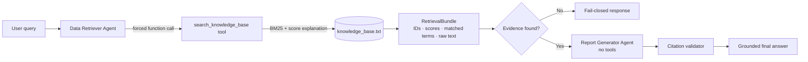
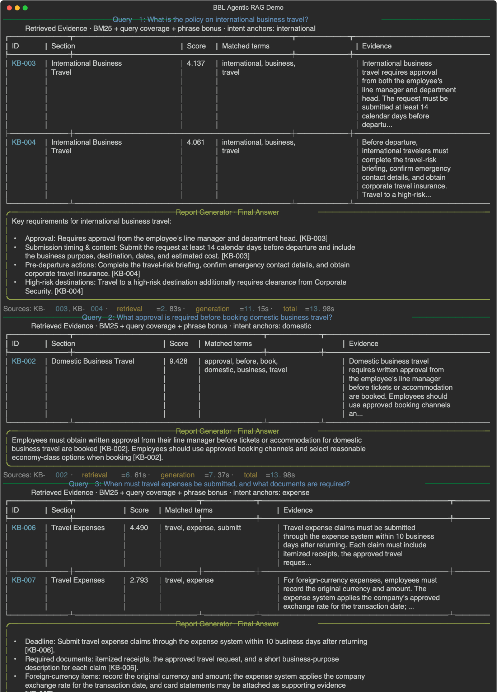
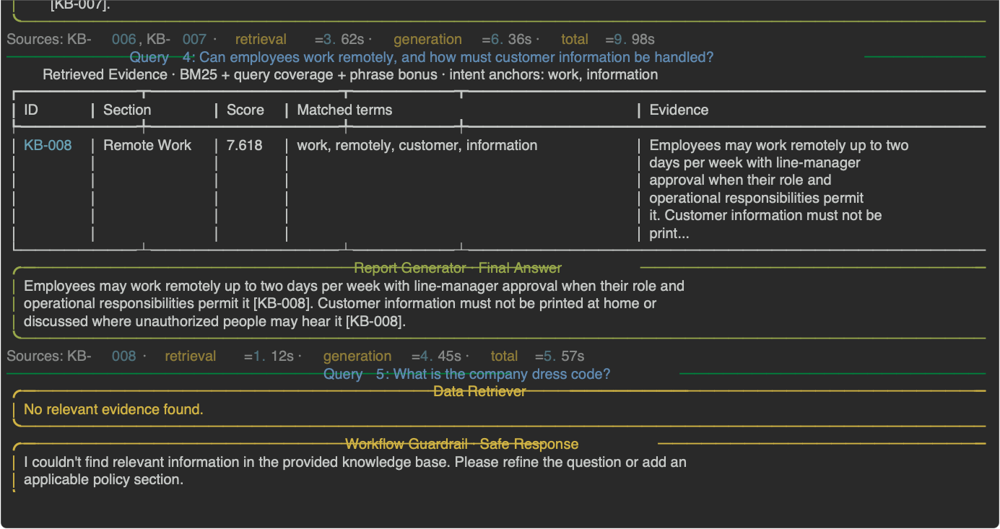

# BBL Agentic RAG — Explainable Two-Agent Workflow

A compact, auditable implementation of the **AI Engineer Programming Test: Agentic AI**. The system uses two real OpenAI Agents SDK agents, a custom local retrieval tool, and an explicit sequential transfer of evidence.

> **Data notice:** `knowledge_base.txt` contains fictional demonstration policies. It does not represent Bangkok Bank or any real organization.

## Architecture



The workflow is deliberately deterministic between the two agents. The Data Retriever is forced to call one custom tool and uses `stop_on_first_tool`, so its final output is the raw retrieval result—not an answer. The Report Generator receives only the original query and retrieved evidence.

## Why this is explainable

| Layer | Evidence available to a reviewer |
|---|---|
| Retrieval | Stable IDs, BM25 score, matched terms, per-term contributions, rare section-title intent anchors, a 40% query-coverage gate, phrase bonus, metadata exclusion, and contradictory-qualifier filtering |
| Orchestration | Explicit `Data Retriever → Report Generator` code path and typed `RetrievalBundle` |
| Generation | Inline citations such as `[KB-003]`; the reporter has no tools or file access |
| Validation | Unknown citations are rejected; empty retrieval stops before generation |
| Operations | Stage timings are shown without logging prompts, keys, or environment values |

The notebook at `notebooks/explainable_rag_walkthrough.ipynb` walks through the scoring mechanics. It is a companion artifact, not a second implementation.

## Guardrails and boundaries

- The Retriever is forced to call the named local search tool, and the workflow rejects any altered tool output.
- The tool searches the exact original user query from typed workflow context; an LLM-generated
  paraphrase cannot silently change retrieval behavior.
- Retrieved text is labeled as untrusted data; the Reporter has no tools or direct file access.
- Answers must contain inline citations whose IDs exactly match the declared, retrieved sources. Invalid output is retried once and then rejected.
- Empty retrieval fails closed before the Reporter is called, preventing an unsupported generated answer.
- SDK tracing is disabled by default, credentials are loaded only from the environment, and public errors omit request bodies and secret values.

The citation validator proves provenance and citation consistency; it does not prove semantic entailment of every generated sentence. A production system should add a labeled evaluation set, threshold calibration, and human review for high-impact policy answers.

## Quick start

Python 3.11–3.13 is supported.

```bash
python -m venv .venv
source .venv/bin/activate
python -m pip install -e ".[dev,notebook]"
cp .env.example .env
```

Set `OPENAI_API_KEY` in `.env` or export it in your shell. Never commit `.env`.

```bash
# Inspect retrieval without an API key
python main.py "What approvals are required for international travel?" --retrieval-only

# Run the complete two-agent workflow
python main.py "What approvals are required for international travel?"

# Run the five-query evaluation demo
python main.py --demo
```

`python -m agentic_rag --demo` is an equivalent module entry point.

To capture the exact Rich-rendered terminal transcript as an SVG:

```bash
python main.py --demo --export-svg docs/screenshots/demo-output.svg
```

## Live evaluation output

The screenshots below were produced by one live `gpt-5-mini` run. Five deliberately
different cases exercise more than happy-path keyword matching:

| Query | Evaluation purpose | Expected evidence/behavior |
|---:|---|---|
| 1 | Assignment-example international policy | `KB-003`, `KB-004` |
| 2 | Domestic/international near-neighbor disambiguation | `KB-002` only |
| 3 | Evidence synthesis across expense paragraphs | `KB-006`, `KB-007` |
| 4 | Separate policy domain plus customer-information constraint | `KB-008` |
| 5 | Unsupported policy request | Fail closed under `Workflow Guardrail`; do not call Report Generator |





## Configuration

| Variable | Required | Default | Purpose |
|---|---:|---|---|
| `LLM_PROVIDER` | No | `openai` | `openai` or `azure` |
| `OPENAI_API_KEY` | For OpenAI live runs | — | API authentication |
| `OPENAI_MODEL` | No | `gpt-5-mini` | Model used by both agents |
| `KNOWLEDGE_BASE_PATH` | No | `knowledge_base.txt` | Local text source |
| `RETRIEVAL_MAX_RESULTS` | No | `5` | Safety cap after relevance filtering |
| `RETRIEVAL_MIN_SCORE` | No | `0.15` | Minimum accepted retrieval score |
| `RETRIEVAL_MIN_COVERAGE` | No | `0.40` | Minimum meaningful query-term coverage |
| `ENABLE_TRACING` | No | `false` | Opt-in SDK tracing |

Azure OpenAI adapter construction is unit-tested with the four `AZURE_OPENAI_*` values shown in `.env.example`. Its API version is intentionally required rather than guessed. The captured live demo uses the OpenAI provider; an end-to-end Azure run still requires a valid Azure credential, deployment, and supported API version.

## Evaluation-criteria mapping

| Assignment criterion | Implementation |
|---|---|
| Framework and orchestration | Two SDK `Agent` objects plus explicit sequential workflow |
| Custom RAG mechanism | File-reading function tool and explainable BM25 ranking |
| Final-answer quality | Evidence-only prompt, structured output, inline citations, and provenance validation |
| Code quality | Typed boundaries, dependency-injected runner, unit tests, lint, CI, and safe errors |

## Tests and reproducibility

```bash
ruff check .
pytest --cov=agentic_rag --cov-report=term-missing
jupyter nbconvert --execute --to notebook --inplace notebooks/explainable_rag_walkthrough.ipynb
```

Unit tests never call an external model. The notebook also runs without a key and skips only its clearly labeled optional live-agent cell. GitHub Actions enforces lint, tests, coverage, and notebook execution.

## Design decisions and limitations

- **BM25 rather than embeddings:** the assignment asks for a simple custom keyword/basic semantic search over a text file. BM25 is deterministic, dependency-light, and easy to audit. The rarest query term found in section titles becomes an intent anchor; a query-coverage gate and mutually exclusive `domestic`/`international` qualifier check further reduce lexical false positives. For a large multilingual corpus, embeddings plus reranking would be the next step.
- **Code orchestration rather than a handoff:** the required order is fixed. Keeping it explicit makes the evidence boundary testable and prevents the retrieval agent from becoming the user-facing responder.
- **Fail closed:** when retrieval finds nothing, the workflow does not call the Report Generator. This reduces hallucination risk and unnecessary model cost.
- **No notebook-only implementation:** notebooks are strong explanatory artifacts but weak application boundaries. The package and CLI are the source of truth; the notebook demonstrates them.
- **No production claims:** this is a focused assessment solution, not a deployed banking platform. Production extensions would include identity-aware access control, encrypted audit storage, redaction, evaluated retrieval thresholds, rate limits, and human approval for sensitive actions.
